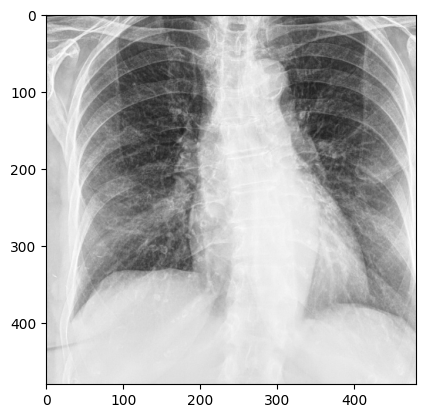

<a name="readme-top"></a>

[![Contributors][contributors-shield]][contributors-url]
[![Forks][forks-shield]][forks-url]
[![Stargazers][stars-shield]][stars-url]
[![Issues][issues-shield]][issues-url]
[![Apache License][license-shield]][license-url]


<!-- PROJECT LOGO -->
<br />
<div align="center">
  <a href="https://github.com/mithril-security/blindai">
    
  </a>

<h3 align="center">BlindAI</h3>

[![Website][website-shield]][website-url]
[![Blog][blog-shield]][blog-url]
[![LinkedIn][linkedin-shield]][linkedin-url]

  <p align="center">
    <b>BlindAI</b> helps deploy AI models with an added <b>privacy layer</b>, 
    protecting the data sent to be analysed by the model and the model's IP. 
    <br />
    <a href="https://blindai.mithrilsecurity.io/en/latest/"><strong>Explore the docs »</strong></a>
    <br />
    <br />
    <a href="https://blindai-preview.mithrilsecurity.io/en/latest/getting-started-quick-tour">Try Demo</a>
    ·
    <a href="https://github.com/mithril-security/blindai/issues">Report Bug</a>
    ·
    <a href="https://github.com/mithril-security/blindai/issues">Request Feature</a>
  </p>
</div>


<!-- TABLE OF CONTENTS -->
<details>
  <summary>Table of Contents</summary>
  <ol>
    <li>
      <a href="#-about-the-project">About The Project</a>
      <ul>
        <li><a href="#built-with">Built With</a></li>
      </ul>
    </li>
    <li>
      <a href="#-getting-started">Getting Started</a>
      <ul>
        <li><a href="#prerequisites">Prerequisites</a></li>
        <li><a href="#installation">Installation</a></li>
      </ul>
    </li>
    <li><a href="#-usage">Usage</a></li>
    <li><a href="#-roadmap">Roadmap</a></li>
    <li><a href="#-getting-help">Getting Help</a></li>
    <li><a href="#-license">License</a></li>
    <li><a href="#-contact">Contact</a></li>
    <li><a href="#-disclaimer">Disclaimer</a></li>
  </ol>
</details>

<!-- ABOUT THE PROJECT -->
## 🔒 About The Project

***[SO I THINK CONFIDENTIAL AI INFERENCE SERVER DOESN'T MEAN ANYTHING REALLY HAHA. WE CAN REWORK THAT. I GUESS THE PLAN IS TO REWORK THE HOMEPAGE AND COPY PASTE IT FROM THERE? LET'S SEE WITH CORENTIN/MEHDI WHAT WE CAN COME UP WITH. CORENTIN TOLD ME ]***
BlindAI is a **confidential AI inference server**. It works like any regular AI inference solution but **with an added privacy layer**. 

Our solution comes in two parts:

- A secure inference **server** to deploy AI models with privacy guarantees 
- A Python **client** SDK to securely query the remote AI models


### Built With 

[![Rust][Rust]][Rust-url] [![Python][Python]][Python-url] [![Intel-SGX][Intel-SGX]][Intel-sgx-url] [![Tract][Tract]][tract-url]

<p align="right">(<a href="#readme-top">back to top</a>)</p>

<!-- GETTING STARTED -->
## 🚀 Getting Started

You can go try out our [Quick tour](LIEN) in the documentation to discover BlindAI with a hands-on example using [COVID-Net](https://github.com/lindawangg/COVID-Net).

But here’s a taste of what using BlindAI could look like 🍒

In our scenario: an AI company and their client are collaborating so that:
- the client can feed their confidential data to the model while preserving privacy.
- the AI company can protect their model's secret IP.

### AI company's POV

#### Uploading and deleting models

An AI company uploads their model to the server, which is assigned a model ID.

```py
response = client_1.upload_model(model="./COVID-Net-CXR-2.onnx")
MODEL_ID = response.model_id
print(MODEL_ID)

8afcdab8-209e-4b93-9403-f3ea2dc0c3ae
```

When collaborating with the client is done, the AI company can delete their model from the server.

```py
# AI company deletes model after use
client_1.delete_model(MODEL_ID)
```

### Client's POV

#### Running a model on confidential data

The client connects and runs the model on the following confidential image.



```py
pos_ret = client_2.run_model(MODEL_ID, positive)
print("Probability of Covid for positive image is", pos_ret.output[0].as_flat()[0][1])

Probability of Covid for positive image is 0.890598714351654
```

_For more examples, please refer to the [Documentation](https://blindai.mithrilsecurity.io/en/latest/)_
<p align="right">(<a href="#readme-top">back to top</a>)</p>

### Installation

#### Deploying BlindAI on Azure DCsv3 VM

**🥇 Recommended 🥇**

**✅ Pros**

- No requirement to have your own Intel SGX-ready device or a particular distribution. 
- Secure. Hardware security guarantees protect your data and model from any third-party access.

**❌ Cons:**

- Can be more expensive than local deployment.

If this is the right method for you, you can deploy the server in your Azure DCsv3 VM using our docker image with the following command:

**[TODO: CHECK THIS COMMAND]**
```py
docker run -it \
-p 9223:9223 \
-p 9224:9224 \ 
mithrilsecuritysas/blindai-preview-server:latest
```

For instructions on how to set up your Azure DCsv3 VM, alternative deployment methods or more information, visit [our installation page](--direct link reference to the cloud deployement part)

#### On-premise deployment

⚠️ Needs Intel SGX+FLC ⚠️

**✅ Pros**

- Secure. Hardware security guarantees protect your data and model from any third-party access.
- Can be less costly than paying for access to VM.

**❌ Cons:**

- You must have an Intel SGX-ready device with `SGX+FLC` support.
- BlindAI was created to run with SGX2, which has a better performance and much more memory available than SGX1. You could still deploy the server with SGX1 but the client will only be able to connect in `simulation` mode.
- You need to install all the pre-requisites to BlindAI's use.

You can check out our instructions for installing BlindAI for development on-premises [here](https://github.com/mithril-security/blindai-preview/blob/ophelie-README-rewrite/docs/docs/deploy-on-premise.md) and see if you are eligible for SGX2.

#### Testing BlindAI without hardware security guarantees

🧪 For testing ONLY 🧪

**✅ Pros**

- Quick and easy.
- Works on any device. Very few pre-requisites.
- Demos available on BlindAI GitHub.

**❌ Cons:**

- This option does not offer the hardware security guarantees of Intel SGX. **It is not suitable for production.**

If this is the right option for you, you can:

- Check out our [quick tour notebook](#Quick tour). This will show you how you can install and use BlindAI's client and server testing packages.
- Test your own Python scripts or notebooks using the `blindai_preview` PyPi packages with the `blindai_preview.testing` server.

If you have any trouble with these your test programs, compare your usage against our [example notebooks](link) or <a href="#-getting-help">contact us directly</a>!
<p align="right">(<a href="#readme-top">back to top</a>)</p>

<!-- ROADMAP -->
## 🎯 Roadmap

WRITE DOWN THE FEATURES WE **ALREADY** IMPLEMENTED. NOTHING SATISFYING LIKE A LIST WITH CHECKED BOXES.

WE CAN ALSO RENAME THAT PART **KEY FEATURES**

- [ ] Feature 1
- [ ] Feature 2
- [ ] Feature 3
    - [ ] Nested Feature

<p align="right">(<a href="#readme-top">back to top</a>)</p>

<!-- GETTING HELP -->

## 🙋 Getting help

* Go to our [Discord](https://discord.com/invite/TxEHagpWd4) #support channel
* Report bugs by [opening an issue on our BlindAI GitHub](https://github.com/mithril-security/blindai/issues)
* [Book a meeting](https://calendly.com/contact-mithril-security/15mins?month=2023-03) with us

<p align="right">(<a href="#readme-top">back to top</a>)</p>


<!-- LICENSE -->
## 📜 License

Distributed under the Apache License, version 2.0. See [`LICENSE.md`](https://www.apache.org/licenses/LICENSE-2.0) for more information.


<!-- CONTACT -->
## 📇 Contact

Mithril Security - [@MithrilSecurity](https://twitter.com/MithrilSecurity) - contact@mithrilsecurity.io

Project Link: [https://github.com/mithril-security/blindai](https://github.com/mithril-security/blindai)


<!-- DISCLAIMER -->
## 📢 Disclaimer

IF WE NEED TO SAY STUFF ABOUT PRODUCTION READINESS OF BLINDAI

<p align="right">(<a href="#readme-top">back to top</a>)</p>

<!-- MARKDOWN LINKS & IMAGES -->
<!-- https://github.com/alexandresanlim/Badges4-README.md-Profile#-blog- -->
[contributors-shield]: https://img.shields.io/github/contributors/mithril-security/blindai.svg?style=for-the-badge
[contributors-url]: https://github.com/mithril-security/blindai/graphs/contributors
[forks-shield]: https://img.shields.io/github/forks/mithril-security/blindai.svg?style=for-the-badge
[forks-url]: https://github.com/mithril-security/blindai/network/members
[stars-shield]: https://img.shields.io/github/stars/mithril-security/blindai.svg?style=for-the-badge
[stars-url]: https://github.com/mithril-security/blindai/stargazers
[issues-shield]: https://img.shields.io/github/issues/mithril-security/blindai.svg?style=for-the-badge
[issues-url]: https://github.com/mithril-security/blindai/issues
[license-shield]: https://img.shields.io/github/license/mithril-security/blindai.svg?style=for-the-badge
[license-url]: https://github.com/mithril-security/blindai/blob/master/LICENSE.txt
[linkedin-shield]: https://img.shields.io/badge/-Jobs-black.svg?style=for-the-badge&logo=linkedin&colorB=555
[linkedin-url]: https://www.linkedin.com/company/mithril-security-company/
[website-url]: https://www.mithrilsecurity.io
[website-shield]: https://img.shields.io/badge/website-000000?style=for-the-badge&colorB=555
[blog-url]: https://blog.mithrilsecurity.io/
[blog-shield]: https://img.shields.io/badge/Blog-000?style=for-the-badge&logo=ghost&logoColor=yellow&colorB=555
[product-screenshot]: images/screenshot.png
[Python]: https://img.shields.io/badge/Python-FFD43B?style=for-the-badge&logo=python&logoColor=blue
[Python-url]: https://www.python.org/
[Rust]: https://img.shields.io/badge/rust-FFD43B?style=for-the-badge&logo=rust&logoColor=black
[Rust-url]: https://www.rust-lang.org/fr
[Intel-SGX]: https://img.shields.io/badge/SGX-FFD43B?style=for-the-badge&logo=intel&logoColor=black
[Intel-sgx-url]: https://www.intel.fr/content/www/fr/fr/architecture-and-technology/software-guard-extensions.html
[Tract]: https://img.shields.io/badge/Tract-FFD43B?style=for-the-badge
[tract-url]: https://github.com/mithril-security/tract/tree/6e4620659837eebeaba40ab3eeda67d33a99c7cf

<!-- Done using https://github.com/othneildrew/Best-README-Template -->
